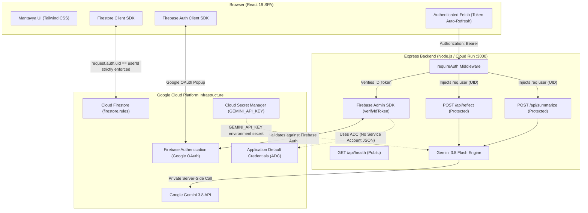

# Mantavya (मंतव्य) — Private AI-Assisted Reflection

> Built for the **Google Gen AI Academy APAC Edition Ideathon**.  
> Production-ready, hardened full-stack reflection application powered by Gemini 3.8 and Google Cloud.

---

## 1. Product Purpose & Philosophy

**Mantavya** is a private, AI-assisted reflection sanctuary designed to help individuals step outside their immediate emotional gravity, understand what is actually happening, examine their assumptions, look through the eyes of a fair-minded observer, and decide what is genuinely in their own best interest.

### Not a Therapist, Coach, or Motivational Speaker
Mantavya does not make decisions for you, provide medical counsel, or offer empty cheerleading. Instead, it strengthens your own discernment and judgment.

### The Core Triad
$$\text{REALITY} \longrightarrow \text{PERSPECTIVE} \longrightarrow \text{AGENCY}$$

- **Reality**: Separate objective facts from the stories, identities, or catastrophic conclusions attached to them.
- **Perspective**: The *Wider Lens* — seeing the situation as an intelligent, compassionate outside observer would.
- **Agency**: Clarify the line between what is within your control and what is not, then ask: *"What would genuinely be in your best interest now?"*

### Core Operating Principle
> **"Challenge the interpretation, not the person."**  
> Honesty without humiliation, warmth without empty reassurance.

---

## 2. Hardened Security & Zero-Trust Architecture

Mantavya adopts a zero-trust, defense-in-depth architecture where both client-side Firestore access and server-side AI reasoning are strictly gated by cryptographically verified Firebase Authentication tokens.



### Security Pillars

1. **Backend ID-Token Verification**:
   - `POST /api/reflect` and `POST /api/summarize` are strictly guarded by `requireAuth` Express middleware.
   - Every incoming request must provide `Authorization: Bearer <Firebase ID token>`.
   - The token is cryptographically verified on the server using `firebase-admin/auth` `verifyIdToken()`.
   - Expired, missing, or invalid tokens are rejected with HTTP 401 and machine-readable error codes (`TOKEN_EXPIRED`, `TOKEN_INVALID`, `AUTH_HEADER_MISSING`).
   - The backend attaches the verified identity (`req.user = { uid, email }`) and **never trusts any client-supplied user identity**.

2. **Automatic Token Refresh in Client**:
   - The React client wrapper (`src/services/apiClient.ts`) uses Firebase Auth's `user.getIdToken()`.
   - When a token expires, `authenticatedFetch` automatically triggers `getIdToken(true)` (force refresh) and retries the call transparently.

3. **Application Default Credentials (ADC)**:
   - Firebase Admin SDK is initialized via `initializeApp({ projectId })` using Google Cloud Application Default Credentials.
   - **No service-account JSON files or private keys are ever committed to the repository.**
   - On Google Cloud Run, authentication is managed natively by the container's attached service account.

4. **Zero-Exposure Server-Side Gemini**:
   - `GEMINI_API_KEY` is strictly held on the server (`process.env.GEMINI_API_KEY`) and is never prefixed with `VITE_` or sent to the browser.
   - Browser requests proxy through the authenticated API layer.

5. **Firestore Client-Side User Isolation**:
   - All user data is partitioned under `/users/{userId}/reflections/{reflectionId}`.
   - Firestore security rules mandate `request.auth != null && request.auth.uid == userId`.
   - Documents enforce schema validation, enum boundaries, and payload size bounds (`title.size() <= 200`, `content <= 10000`) to prevent Denial-of-Wallet attacks.

6. **Privacy & Logging Hygiene**:
   - Sensitive reflection thoughts and authorization tokens are strictly filtered out of server logs.
   - Only non-sensitive operational errors (e.g. status codes, sanitized error messages) are recorded.

7. **Public Health Endpoint**:
   - `GET /api/health` returns operational status without requiring authentication, allowing uptime monitoring and container ingress probes.

---

## 3. Features Breakdown

1. **Adaptive Multi-Turn Reflection**: Natural dialogue without rigid questionnaires. Dynamically detects fact vs. interpretation, event vs. identity, future certainty vs. expectations, hindsight bias, and self-blame.
2. **Reality Check**: Distinguishes between observable facts, user interpretations, underlying assumptions, and control boundaries.
3. **Wider Lens (Observer Perspective)**: Stepping outside emotional intensity to reflect what a fair-minded observer would notice.
4. **Tension Lens**: Identifies competing values or conflicting commitments without judging human contradiction as a flaw.
5. **Complexity Check**: Flags when the user generates excessive new plans instead of executing existing commitments.
6. **Human Perspective**: "Accountability without humiliation" — mistakes are events, not identities.
7. **Agency**: Distinguishes control boundaries and invites calibrated decision-making.
8. **Structured Reflection (Final Synthesis)**: Concludes with an 8-part synthesis:
   - *What Happened*
   - *What I Initially Thought*
   - *What I May Have Assumed*
   - *Wider Lens*
   - *What Became Clearer*
   - *What I Learned*
   - *What I Can Change*
   - *What to Remember*
   - *Before vs. Now* perspective shift
9. **Reflection Archive & Management**: Fully isolated, searchable history of personal sessions with mode filters.

---

## 4. Firestore Security Rules

Stored in `firestore.rules` and deployed via Firebase tools:

```javascript
rules_version = '2';

service cloud.firestore {
  match /databases/{database}/documents {

    // Default deny catch-all
    match /{document=**} {
      allow read, write: if false;
    }

    function isSignedIn() {
      return request.auth != null;
    }

    function isOwner(userId) {
      return isSignedIn() && request.auth.uid == userId;
    }

    function isValidId(id) {
      return id is string && id.size() <= 128 && id.matches('^[a-zA-Z0-9_\\-]+$');
    }

    function incoming() {
      return request.resource.data;
    }

    function existing() {
      return resource.data;
    }

    function isValidReflection(data, userId) {
      return data.id is string && isValidId(data.id)
        && data.userId == userId
        && data.userId == request.auth.uid
        && data.mode in ['understand', 'reality-check', 'decision', 'learn', 'process']
        && data.status in ['active', 'completed']
        && data.title is string && data.title.size() <= 200
        && (!('initialPrompt' in data) || (data.initialPrompt is string && data.initialPrompt.size() <= 10000))
        && (!('widerLens' in data) || (data.widerLens is string && data.widerLens.size() <= 10000))
        && (!('tensionLens' in data) || (data.tensionLens is string && data.tensionLens.size() <= 10000))
        && (!('complexityCheck' in data) || (data.complexityCheck is string && data.complexityCheck.size() <= 10000))
        && (!('messages' in data) || (data.messages is list && data.messages.size() <= 200))
        && (!('realityCheck' in data) || data.realityCheck is map)
        && (!('structuredSummary' in data) || data.structuredSummary is map)
        && data.createdAt is string && data.createdAt.size() <= 40
        && data.updatedAt is string && data.updatedAt.size() <= 40;
    }

    match /users/{userId} {
      allow get: if isOwner(userId) && isValidId(userId);
      allow create, update: if isOwner(userId)
        && isValidId(userId)
        && incoming().uid == userId
        && incoming().uid == request.auth.uid;

      match /reflections/{reflectionId} {
        allow get: if isOwner(userId) && isValidId(reflectionId);
        allow list: if isOwner(userId);
        allow create: if isOwner(userId)
          && isValidId(reflectionId)
          && isValidReflection(incoming(), userId)
          && incoming().id == reflectionId;
        allow update: if isOwner(userId)
          && isValidId(reflectionId)
          && isValidReflection(incoming(), userId)
          && incoming().id == existing().id
          && incoming().userId == existing().userId;
        allow delete: if isOwner(userId) && isValidId(reflectionId);
      }
    }
  }
}
```

---

## 5. Local Development & Deployment

### Prerequisites
- Node.js 20+
- A Google Cloud / Firebase project with Google Authentication & Firestore enabled.
- A Gemini API Key from Google AI Studio.

### Environment Configuration
Copy `.env.example` to `.env`:
```bash
GEMINI_API_KEY="your-gemini-api-key"
PORT=3000
```

### Install Dependencies
```bash
npm install
```

### Run Locally
```bash
npm run dev
```
The application will start at `http://localhost:3000`.

### Production Build & Start
```bash
npm run build
npm start
```
The build bundles the Vite React SPA into `dist/` and compiles the Node.js Express backend into `dist/server.cjs` using `esbuild`.

### Deploying to Google Cloud Run with Secret Manager
Deploy the container to Cloud Run mounting `GEMINI_API_KEY` from Google Secret Manager:

```bash
# 1. Store secret in Cloud Secret Manager
echo -n "your-gemini-api-key" | gcloud secrets create GEMINI_API_KEY --data-file=-

# 2. Grant Secret Accessor to default Compute Service Account
PROJECT_NUMBER=$(gcloud projects describe $(gcloud config get-value project) --format="value(projectNumber)")
gcloud secrets add-iam-policy-binding GEMINI_API_KEY \
  --member="serviceAccount:${PROJECT_NUMBER}-compute@developer.gserviceaccount.com" \
  --role="roles/secretmanager.secretAccessor"

# 3. Deploy to Cloud Run
gcloud run deploy mantavya \
  --source . \
  --platform managed \
  --region asia-southeast1 \
  --allow-unauthenticated \
  --set-secrets GEMINI_API_KEY=GEMINI_API_KEY:latest
```

When deployed on Cloud Run:
- Cloud Run automatically injects Application Default Credentials (ADC), enabling the Firebase Admin SDK to authenticate without credentials files.
- The `GEMINI_API_KEY` is mounted securely via Secret Manager directly into the container's environment.

---

## 6. Verification & Quality Assurance

- **TypeScript Type Safety**: `npm run lint` (`tsc --noEmit`) validates 100% of client and server code with zero errors.
- **Production Compilation**: `npm run build` compiles Vite frontend assets and bundles the Express backend cleanly.
- **Firestore Security Rules**: Deployed and enforced against unauthorized reads and tampering.
- **Health Verification**: Checked `GET /api/health` returns `{ "status": "ok" }`.

---

© 2026 Mantavya — Private AI Reflection. Built for Google Gen AI Academy APAC Ideathon.
